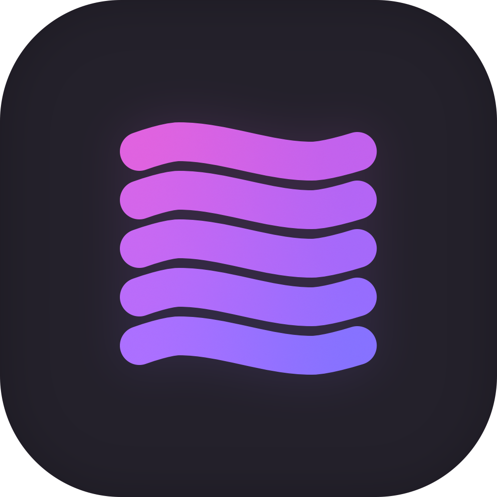

[![Rust]][Rust-url]
[![Build][build-shield]][build-url]
[![Contributors][contributors-shield]][contributors-url]
[![Forks][forks-shield]][forks-url]
[![Stargazers][stars-shield]][stars-url]
[![Issues][issues-shield]][issues-url]
[![GPL3 License][license-shield]][license-url]

 

  

<h3 align="center">Chorus</h3>

  

    A rust library for interacting with (multiple) Spacebar-compatible APIs and Gateways (at the same time).
     
    <a href="https://github.com/polyphony-chat/chorus"><strong>Explore the docs »</strong></a>
     
     
    <a href="https://github.com/polyphony-chat/chorus/issues">Report Bug</a>
    ·
    <a href="https://github.com/polyphony-chat/chorus/issues">Request Feature</a>
    ·
    <a href="https://discord.gg/8tKSC8wzDq">Join Discord</a>
  

## Roadmap

Core functionality:

- [x] Rate Limiter (hint: couldn't be fully tested due to [an Issue with the Spacebar Server](https://github.com/spacebarchat/server/issues/1022))
- [x] Login (conventional way) (Guess what? Found [an Issue with the Spacebar Server](https://github.com/spacebarchat/server/pull/1043) :3)
- [ ] 2FA
- [x] Registration (encountered another [Issue with the Spacebar Server](https://github.com/spacebarchat/server/issues/1040) which makes some error messages an empty string)
- [ ] Gateway Events, multithreaded
- [x] Sending messages (Text, Images, Attachments)
- [x] Events (Message, User, Channel, etc.)
- [ ] Adding, deleting and editing channels
- [ ] User profile customization
- [ ] Deleting messages
- [ ] Emoji
- [ ] Stickers
- [ ] Listing users and user profiles
- [ ] Message threads
- [ ] Forum channels

[Rust]: https://img.shields.io/badge/Rust-orange?style=plastic&logo=rust
[Rust-url]: https://www.rust-lang.org/
[build-shield]: https://img.shields.io/github/actions/workflow/status/polyphony-chat/chorus/rust.yml?style=plastic
[build-url]: https://github.com/polyphony-chat/chorus/blob/main/.github/workflows/rust.yml
[contributors-shield]: https://img.shields.io/github/contributors/polyphony-chat/chorus.svg?style=plastic
[contributors-url]: https://github.com/polyphony-chat/chorus/graphs/contributors
[forks-shield]: https://img.shields.io/github/forks/polyphony-chat/chorus.svg?style=plastic
[forks-url]: https://github.com/polyphony-chat/chorus/network/members
[stars-shield]: https://img.shields.io/github/stars/polyphony-chat/chorus.svg?style=plastic
[stars-url]: https://github.com/polyphony-chat/chorus/stargazers
[issues-shield]: https://img.shields.io/github/issues/polyphony-chat/chorus.svg?style=plastic
[issues-url]: https://github.com/polyphony-chat/chorus/issues
[license-shield]: https://img.shields.io/github/license/polyphony-chat/chorus.svg?style=plastic
[license-url]: https://github.com/polyphony-chat/chorus/blob/master/LICENSE
